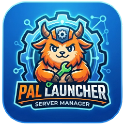

  

# Pal Launcher Server Manager

> **The free, open-source dashboard to run your Palworld server like a pro. No hosting service required. Install on your PC in 5 minutes.**

[🇬🇧 English](#english) • [🇫🇷 Français](#français)

---

## English

### Why Pal Launcher Server Manager?

| Feature | Pal Launcher | Nitrado | G-Portal | Self-Hosted (manual) |
|---------|------|---------|----------|----------------------|
| **Free** | ✅ | ❌ ($10-40/mo) | ❌ ($15-30/mo) | ✅ |
| **Web dashboard** | ✅ | ✅ | ✅ | ❌ (files only) |
| **Admin commands** | ✅ | ✅ | ✅ | ❌ |
| **Easy install** | ✅ One-click .exe | ✅ Auto | ✅ Auto | ❌ Manual |
| **Mods (UE4SS)** | ✅ 1-click install | ❌ Extra fee | ❌ Extra fee | ✅ Manual |
| **Open source** | ✅ MIT | ❌ Proprietary | ❌ Proprietary | ✅ |
| **No subscription** | ✅ | ❌ | ❌ | ✅ |
| **Share via web** | ✅ Friends access dashboard | ✅ | ✅ | ❌ Files only |
| **Cloud backups** | 🔄 Local only | ✅ | ✅ | 🔄 Local only |

### 🚀 Get Started in 2 Minutes

**Option 1: One-Click Desktop App (Recommended)**

1. [Download `PalLauncherServerManager-Setup.exe`](https://github.com/Nothinx-44/palworld-launcher-server-manager/releases) (latest release)
2. Double-click → Windows asks for admin → follow wizard
3. Done. Dashboard is live at `http://localhost:3000`

> ⚠️ **Windows only.** Both the desktop app and the web dashboard rely on Windows-specific
> tooling (NSSM for the Windows service, PowerShell, Windows Firewall) to control the Palworld
> server. There is no Linux/Mac support at this time, and the source code isn't public, so
> self-hosting the dashboard on another OS isn't possible right now.

### ✨ Features at a Glance

**Server Control**
- ⚡ Start / Stop / Restart with one click
- 🔄 Auto-restart if server crashes (watchdog)
- ⏰ Scheduled restarts with player warnings
- 💾 Manual + automatic backups (configurable schedule)

**Player Management**
- 👥 See who's online in real-time
- 🗺️ Live map with player positions
- 🔨 Kick / Ban / Unban players
- 💬 Broadcast messages to all players
- 📊 Player history & playtime tracking

**Admin Features**
- 📝 Edit world settings (difficulty, PvP, drop rates) without restarting
- 🔐 Manage player accounts (admin / user / read-only roles)
- 📋 Activity log (who did what, when)
- 🎮 Admin commands (PalDefender integration)
- 📈 Server metrics (FPS, uptime, players)

**Integrations**
- 🤖 Discord notifications (crashes, backups, player joins)
- 🧩 One-click UE4SS & PalDefender plugin install
- 🔗 Share access via web link (your friends see the dashboard too)

**Developer Friendly**
- 🔓 Open source (MIT license)
- 🧪 Full test suite (`npm test`)
- 📡 REST API for custom tools
- 🌍 Multi-language (FR/EN)

### 📸 What It Looks Like

**Dashboard Overview**
- Clean web interface, accessible from any device on your network
- Real-time player list with kick/ban/message options
- Live server map showing player locations
- Server control buttons (Start/Stop/Restart/Backup)

**Admin Console**
- Configure world settings without shutting down
- Manage schedules for backups & restarts
- View complete activity log

**Desktop App (Setup Wizard)**
- Guides you through server setup
- Automatically installs SteamCMD + Palworld + Windows services
- No command line needed

### 🔐 Security Notes

- **Fully self-hosted** — your data never leaves your PC
- **Web-only access** — friends login via browser, zero client install
- **No cloud storage** — backups stay on your disk
- **Open source** — audit the code yourself
- ⚠️ Use strong passwords & non-standard ports (SmartScreen may warn on first run; it's normal)

### ❓ FAQ

**Q: Does Palworld ban you for using this?**  
A: No. This is an admin tool, like notepad edits. Palworld's official API is intentionally public.

**Q: What if my PC crashes?**  
A: The server is a Windows service. It auto-restarts on reboot, and the dashboard reconnects.

**Q: Can I run this on Linux/Mac?**  
A: No. Both the desktop app and the web dashboard rely on Windows-only tooling (NSSM, PowerShell, Windows Firewall) to control the Palworld server. There's no Linux/Mac support, and the source code isn't public to self-host from.

**Q: Is there a cost?**  
A: No. Free & open source. Your only cost is electricity.

**Q: Can I move my server later?**  
A: Yes. Backups are standard Palworld saves — compatible with any server.

**Q: Do you track anything?**  
A: No. Zero telemetry. Everything stays on your machine.

### 🎯 Next Steps

1. [Download the latest release](https://github.com/Nothinx-44/palworld-launcher-server-manager/releases)
2. Run the setup wizard
3. Create a player account in the web dashboard
4. Invite your friends with your IP + port
5. Enjoy your server

### 🐛 Found a Bug?

[Create an issue](https://github.com/Nothinx-44/palworld-launcher-server-manager/issues) or submit a PR.

### 📖 Full Documentation

For advanced setup, command-line install, API details, see [DOCUMENTATION.md](DOCUMENTATION.md).

### 📄 License

MIT — use freely, modify, redistribute. See [LICENSE](LICENSE).

---

## Français

### Pourquoi Pal Launcher Server Manager ?

| Fonctionnalité | Pal Launcher | Nitrado | G-Portal | Manuel (sans outils) |
|---|---|---|---|---|
| **Gratuit** | ✅ | ❌ (10-40€/mois) | ❌ (15-30€/mois) | ✅ |
| **Dashboard web** | ✅ | ✅ | ✅ | ❌ (fichiers only) |
| **Commandes admin** | ✅ | ✅ | ✅ | ❌ |
| **Installation facile** | ✅ Un click .exe | ✅ Auto | ✅ Auto | ❌ Manuel |
| **Mods (UE4SS)** | ✅ 1 click install | ❌ Option payante | ❌ Option payante | ✅ Manuel |
| **Open source** | ✅ MIT | ❌ Propriétaire | ❌ Propriétaire | ✅ |
| **Pas d'abonnement** | ✅ | ❌ | ❌ | ✅ |
| **Accès web amis** | ✅ Ils voient le dashboard | ✅ | ✅ | ❌ Fichiers only |
| **Sauvegardes cloud** | 🔄 Local uniquement | ✅ | ✅ | 🔄 Local uniquement |

### 🚀 Démarrage en 2 Minutes

**Option 1 : Application Desktop (Recommandé)**

1. [Télécharge `PalLauncherServerManager-Setup.exe`](https://github.com/Nothinx-44/palworld-launcher-server-manager/releases) (dernière release)
2. Double-clic → Windows demande admin → suis l'assistant
3. Voilà. Le dashboard est à `http://localhost:3000`

> ⚠️ **Windows uniquement.** L'application desktop et le dashboard web dépendent tous les deux
> d'outils propres à Windows (NSSM pour le service Windows, PowerShell, pare-feu Windows) pour
> piloter le serveur Palworld. Pas de support Linux/Mac pour l'instant, et le code source n'est
> pas public : impossible de s'auto-héberger sur un autre OS actuellement.

### ✨ Fonctionnalités

**Contrôle du Serveur**
- ⚡ Démarrer / Arrêter / Redémarrer en un clic
- 🔄 Redémarrage auto si crash (watchdog)
- ⏰ Redémarrages programmés avec avertissement aux joueurs
- 💾 Sauvegardes manuelles + automatiques (planning configurable)

**Gestion des Joueurs**
- 👥 Voir qui est en ligne en temps réel
- 🗺️ Carte en direct avec positions des joueurs
- 🔨 Kick / Ban / Unban
- 💬 Annonces à tous les joueurs
- 📊 Historique & durée de jeu

**Admin**
- 📝 Modifier réglages du monde (difficulté, PvP, taux) sans redémarrage
- 🔐 Gérer comptes (admin / user / lecture seule)
- 📋 Journal d'activité complet
- 🎮 Commandes admin (intégration PalDefender)
- 📈 Métriques serveur (FPS, uptime, joueurs)

**Intégrations**
- 🤖 Notifications Discord (crashes, sauvegardes, connexions)
- 🧩 Installation 1-clic UE4SS & PalDefender
- 🔗 Partage accès via lien web (tes amis voient le dashboard aussi)

**Pour Devs**
- 🔓 Open source (MIT)
- 🧪 Suite de tests complète (`npm test`)
- 📡 API REST pour outils custom
- 🌍 Multilingue (FR/EN)

### 📸 À Quoi Ça Ressemble

**Tableau de Bord**
- Interface web propre, accessible de n'importe quel appareil sur ton réseau
- Liste des joueurs en direct (kick/ban/message)
- Carte en direct avec positions des joueurs
- Boutons de contrôle (Démarrer/Arrêter/Redémarrer/Sauvegarder)

**Console Admin**
- Configure les réglages du monde sans redémarrage
- Gère les plannings de sauvegardes & redémarrages
- Voir le journal d'activité complet

**Application Desktop (Assistant)**
- Te guide à travers la mise en place
- Installe automatiquement SteamCMD + Palworld + services Windows
- Aucune ligne de commande nécessaire

### 🔐 Sécurité

- **Entièrement auto-hébergé** — tes données ne quittent pas ton PC
- **Accès web uniquement** — tes amis se connectent par navigateur, zéro installation
- **Pas de cloud** — sauvegardes restent sur ton disque
- **Open source** — audite le code toi-même
- ⚠️ Utilise des mots de passe forts & ports non standard (SmartScreen peut avertir au 1er lancement ; c'est normal)

### ❓ FAQ

**Q : Palworld bannit-il pour l'utilisation de Pal Launcher ?**  
A : Non. C'est un outil admin, comme éditer des fichiers. L'API officielle de Palworld est volontairement publique.

**Q : Si mon PC crash ?**  
A : Le serveur est un service Windows. Il redémarre tout seul au reboot.

**Q : Pal Launcher fonctionne-t-il sur Linux/Mac ?**  
A : Non. L'application desktop et le dashboard web dépendent tous les deux d'outils propres à Windows (NSSM, PowerShell, pare-feu Windows) pour piloter le serveur Palworld. Pas de support Linux/Mac, et le code source n'est pas public pour un auto-hébergement.

**Q : C'est payant ?**  
A : Non. Gratuit & open source. Seul coût : l'électricité.

**Q : Je peux déplacer mon serveur plus tard ?**  
A : Oui. Les sauvegardes sont standard Palworld — compatibles partout.

**Q : Vous tracez quelque chose ?**  
A : Non. Zéro télémétrie. Tout reste sur ta machine.

### 🎯 Prochaines Étapes

1. [Télécharge la dernière release](https://github.com/Nothinx-44/palworld-launcher-server-manager/releases)
2. Lance l'assistant de configuration
3. Crée un compte joueur dans le dashboard
4. Invite tes amis avec ton IP + port
5. Profite de ton serveur

### 🐛 Bug trouvé ?

[Crée une issue](https://github.com/Nothinx-44/palworld-launcher-server-manager/issues) ou soumets une PR.

### 📖 Documentation Complète

Pour setup avancé, installation en ligne de commande, détails API, voir [DOCUMENTATION.md](DOCUMENTATION.md).

### 📄 Licence

MIT — utilise librement, modifie, redistribue. Voir [LICENSE](LICENSE).

---

## Advanced / Avancé

Technical details, API reference, development guide (click to expand)

### Manual Installation

See [DOCUMENTATION.md](DOCUMENTATION.md) for:
- Step-by-step setup guide
- API REST reference
- Development & testing (`npm test`, `npm run mock`)
- Desktop app build (`npm run dist`)
- Security considerations

